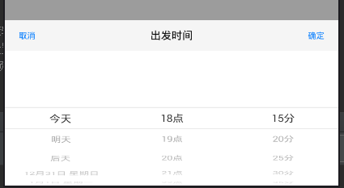

# MyStatus
StatusBar使用

## ImmersionBar
### https://github.com/gyf-dev/ImmersionBar
    使用ImmersionBar来实现状态栏为白色的效果

## Banner的简单使用
### https://github.com/youth5201314/banner

## ExpandableLayout的使用
### https://github.com/cachapa/ExpandableLayout

## PickerView的简单使用
### https://github.com/Bigkoo/Android-PickerView

### 仿滴滴打车的时间选择器
